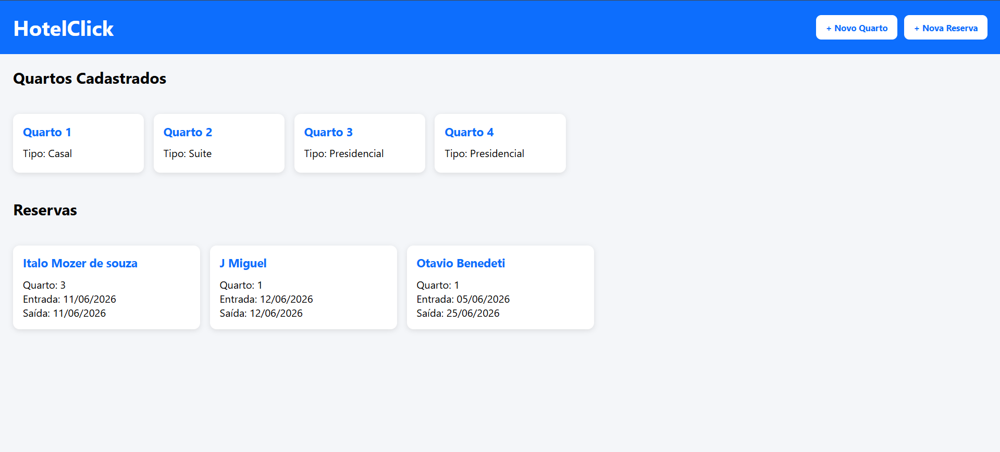

#HotelClick

Bem-vindo ao **HotelClick**!

Este projeto foi desenvolvido com o objetivo de facilitar o gerenciamento de quartos e reservas de um hotel de forma simples, rápida e intuitiva. A aplicação permite cadastrar quartos, visualizar informações e realizar reservas através de uma interface moderna e amigável.

---

## Sobre o Projeto

O HotelClick é um sistema web criado para auxiliar no controle de hospedagens, permitindo que usuários e administradores tenham uma experiência prática na gestão de quartos e reservas.

Este projeto foi desenvolvido como parte dos meus estudos em desenvolvimento Full Stack, colocando em prática conceitos de:

- Desenvolvimento Front-End
- Desenvolvimento Back-End
- Consumo de APIs
- Banco de Dados
- ORM Prisma
- Integração entre sistemas

---

## Funcionalidades

### Gerenciamento de Quartos

- Cadastro de quartos
- Listagem de quartos disponíveis
- Visualização das informações dos quartos
- Atualização de dados
- Exclusão de quartos

###  Gerenciamento de Reservas

- Cadastro de reservas
- Registro do hóspede
- Data de entrada
- Data de saída
- Associação da reserva ao quarto escolhido

---

## Tecnologias Utilizadas

### Front-End

- HTML5
- CSS3
- JavaScript

### Back-End

- Node.js
- Express.js

### Banco de Dados

- PostgreSQL (ou banco utilizado no projeto)

### ORM

- Prisma

---

##  Estrutura do Projeto

```bash
hotelreservas/
│
├── api/
│   ├── controllers/
│   ├── routes/
│   ├── prisma/
│   └── server.js
│
├── front/
│   ├── index.html
│   ├── index2.html
│   ├── style.css
│   └── script.js
│
└── README.md

## Screenshots


